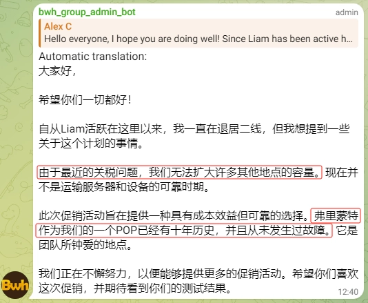
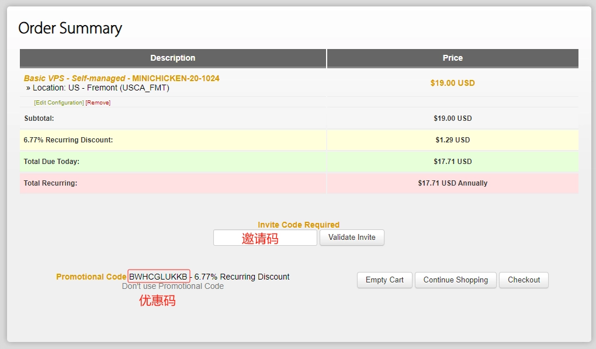
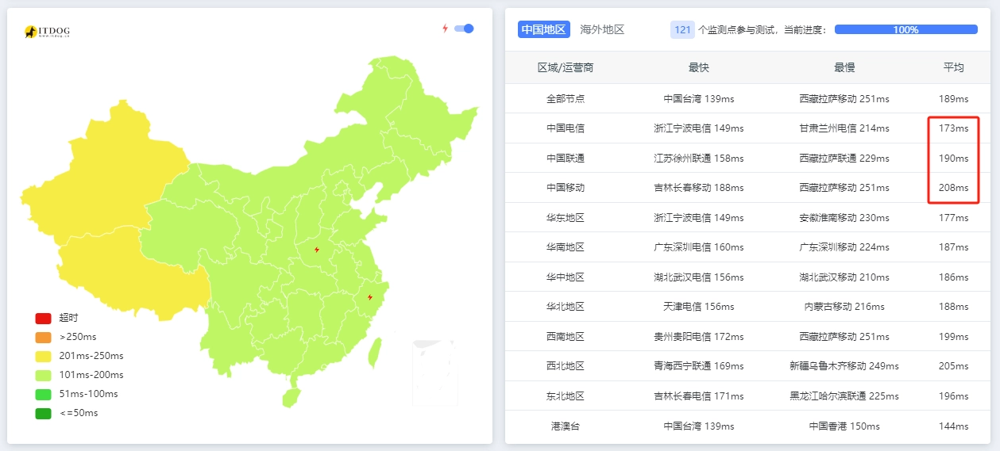
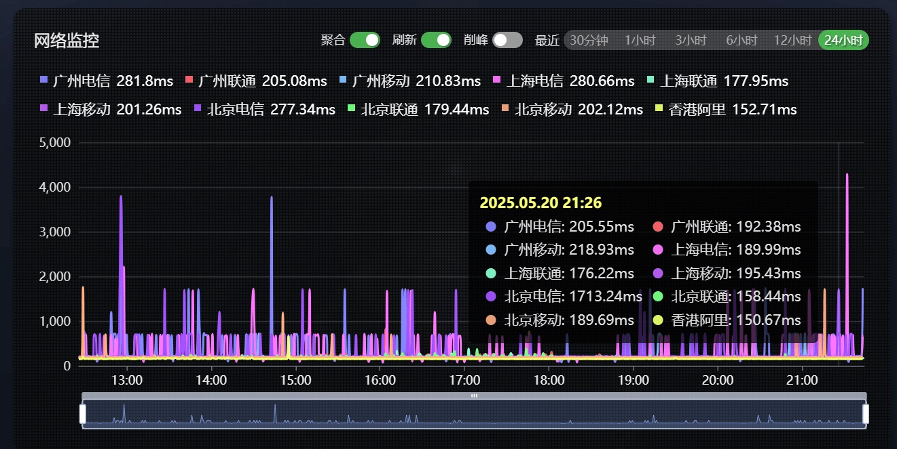
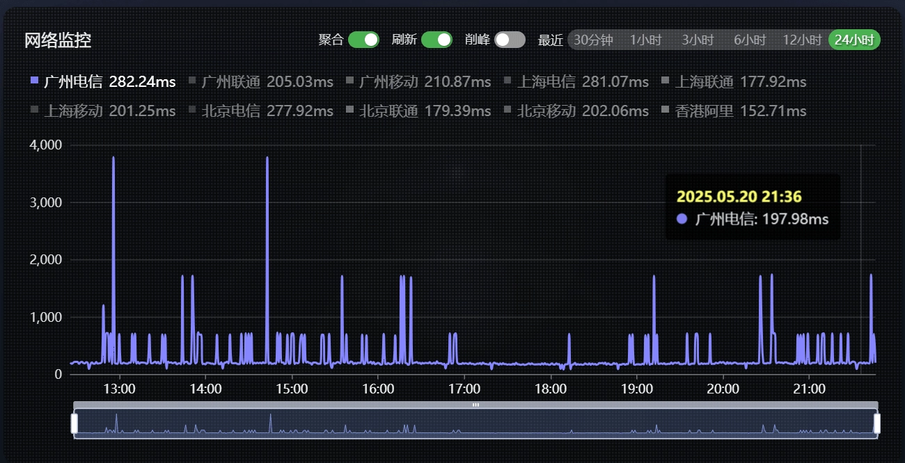
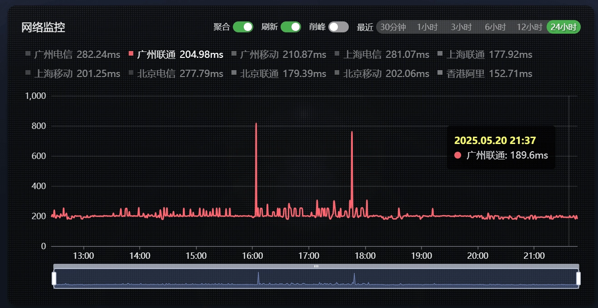
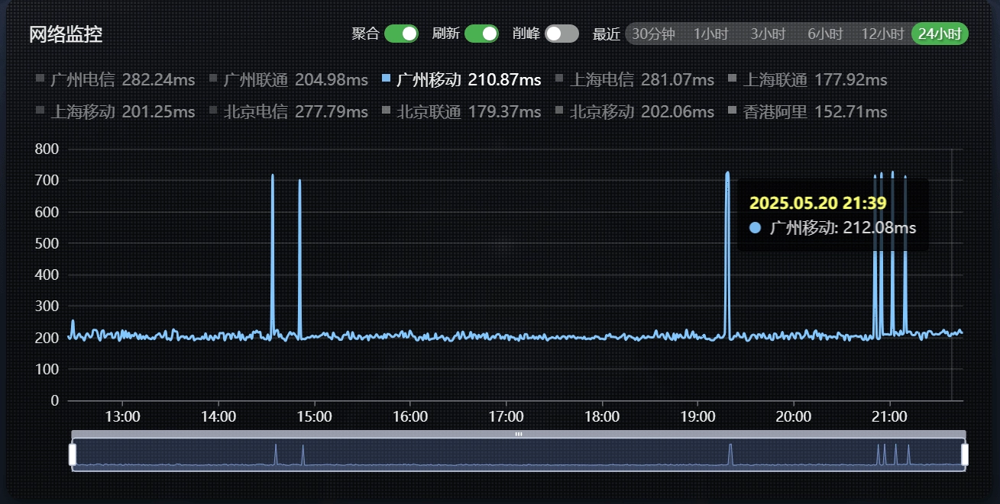
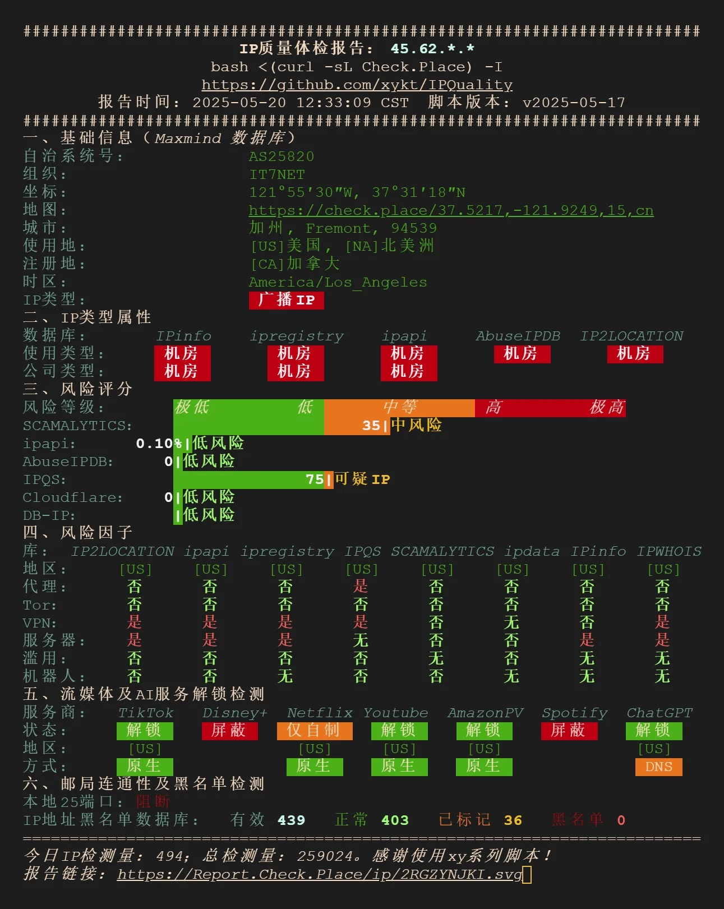
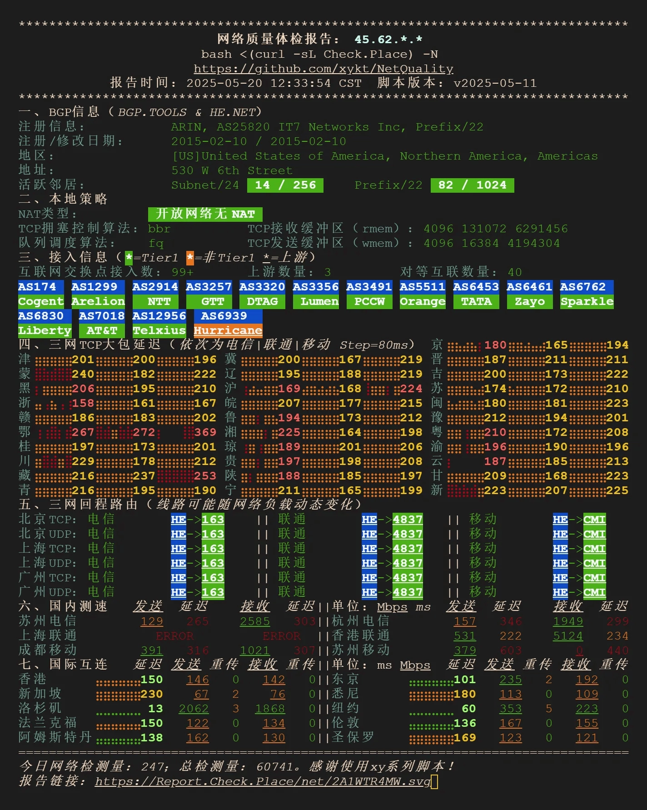
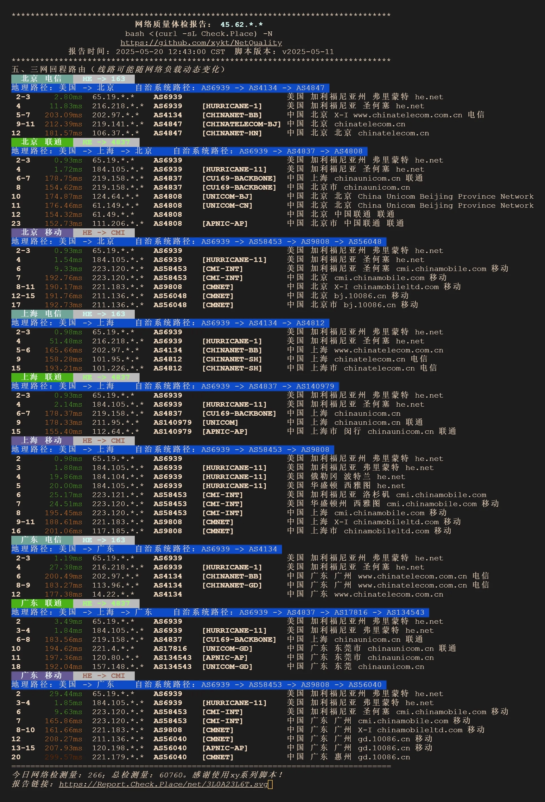

# BandwagonHost's Latest Budget MINICHICKEN Plan: Is It Actually Worth Your Money?

After a long wait, BandwagonHost finally dropped a new VPS plan—but it's not the premium CN2 optimized route everyone hoped for. Instead, they've launched a bare-bones budget option that's gotten the community talking.

Let's cut through the marketing speak and see what this MINICHICKEN plan actually delivers, and whether it makes sense for your specific use case.

---

## What You're Actually Getting



The MINICHICKEN plan comes with these specs:



Limited availability, 30-day money-back guarantee, and notably—even if your IP gets blocked, you're covered. BandwagonHost is using an invite code system for this release.

## Real-World Latency: The Numbers Don't Lie



Non-optimized routing means you're looking at 170-210ms latency. That's... fine for basic tasks, but nothing to write home about.

## Network Stability Breakdown









Here's the interesting part: Mobile users get relatively stable connections, while Telecom and Unicom see noticeable fluctuations. If you're on Mobile, this might actually work decently for you.

## The Technical Deep Dive

```
Basic System Information:
---------------------------------
Uptime     : 0 days, 8 hours, 31 minutes
Processor  : Intel Xeon Processor (Cascadelake)
CPU cores  : 1 @ 2600.064 MHz
AES-NI     : ✔ Enabled
VM-x/AMD-V : ❌ Disabled
RAM        : 1023.5 MiB
Swap       : 545.0 MiB
Disk       : 21.0 GiB
Distro     : Debian GNU/Linux 12 (bookworm)
Kernel     : 6.1.0-9-amd64
VM Type    : KVM
IPv4/IPv6  : ✔ Online / ❌ Offline

fio Disk Speed Tests (Mixed R/W 50/50):
---------------------------------
Block Size | 4k            (IOPS) | 64k           (IOPS)
Read       | 25.02 MB/s    (6.2k) | 181.20 MB/s   (2.8k)
Write      | 25.03 MB/s    (6.2k) | 182.15 MB/s   (2.8k)
Total      | 50.06 MB/s   (12.5k) | 363.36 MB/s   (5.6k)

Block Size | 512k          (IOPS) | 1m            (IOPS)
Read       | 489.07 MB/s    (955) | 617.64 MB/s    (603)
Write      | 515.06 MB/s   (1.0k) | 658.77 MB/s    (643)
Total      | 1.00 GB/s     (1.9k) | 1.27 GB/s     (1.2k)

Geekbench 5 Benchmark Test:
---------------------------------
Single Core     | 684                           
Multi Core      | 664                           

SysBench CPU Test (Fast Mode, 1-Pass @ 5sec):
---------------------------------
1 Thread Score: 880 Scores

SysBench Memory Test (Fast Mode, 1-Pass @ 5sec):
---------------------------------
Single Thread Read:  18638.35 MB/s
Single Thread Write: 16219.34 MB/s
```

Entry-level performance, but hey—at least they gave you SSD storage instead of spinning rust.

## IP Quality Check



## Network Architecture Reality



Connectivity to China goes through Hurricane Electric (HE) peering. In plain English: it's direct but not optimized. Think of it like taking the highway instead of the express lane—you'll get there, just not as fast.

## Return Route Analysis



Telecom and Unicom connect directly through HE backbone routes back to China. Mobile routes through HE to CMI before returning. No major detours, but the latency is pretty standard—nothing special.

For users exploring affordable VPS options, especially those just getting started with hosting or needing simple deployment scenarios, 👉 [BandwagonHost's transparent pricing and straightforward setup process might be exactly what you need for basic projects](https://bandwagonhost.com/aff.php?aff=79616). The question is whether this particular plan hits the right balance for your specific requirements.

## The Bottom Line: Who Should Actually Buy This?

Let's be honest about what you're getting:

**Performance**: CPU performance is mediocre, but the SSD storage is decent. This is entry-level territory.

**Network**: HE direct backbone return route, non-optimized performance. Whether they'll improve the routing later? Your guess is as good as mine.

**Pricing**: $17.71/year (about ¥128) isn't expensive, but the value proposition is questionable.

**Reliability**: BandwagonHost's track record speaks for itself—they claim this node hasn't had a single failure in 10 years. That's impressive.

**Who it's for**: If you're on a tight budget and don't need low latency, this could work. Testing it out makes sense given the 30-day refund window.

---

## Final Thoughts

The MINICHICKEN plan is exactly what it says on the tin: a budget-friendly entry point. It's not going to blow your mind with performance or routing optimization, but for learning environments, basic development work, or low-traffic personal projects, it gets the job done at a price that won't hurt your wallet. The real question is whether "good enough" is actually good enough for what you're trying to accomplish.
